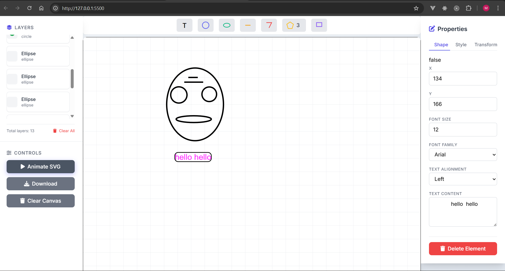

## About 
A lightweight, browser-based SVG Drawing Application that lets you create and edit vector graphics right in your browser — no frameworks, no libraries, just pure web technologies.

## SVG Drawing app

## Technologies Used

- HTML5 – structure and layout
- CSS3 – styling and responsive design
- Vanilla JavaScript – logic and interactivity


## features
- Drawing Tools – create shapes and lines with ease
- Eraser Tool – remove unwanted elements smoothly
- Color Picker – customize stroke and fill colors
- Save Image – export your work as an SVG or image file
- Layers Panel – view and manage all SVG elements
- Properties Editor – adjust size, color, and text dynamically




## How to run it 

```terminal
git clone https://github.com/yourusername/svg-drawing-app.git

npx serve

http://localhost:5500

```

